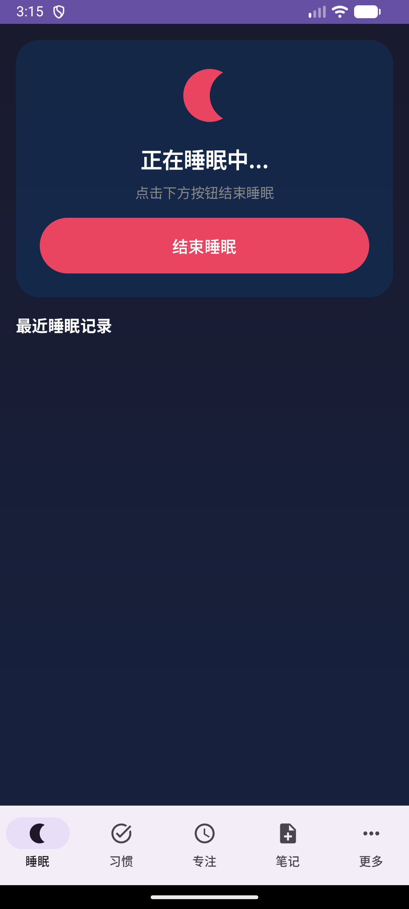

# SleepLife

> 个人生活管理 Android 应用



**版本**: 1.0.0-alpha (versionCode 1) · **最低支持**: Android 8.0 (API 26)

## 简介

SleepLife 是一个功能丰富的个人生活管理应用，帮助你追踪睡眠、培养习惯、记录笔记和提高专注力。

## 功能

### 核心功能

- **睡眠追踪** 🌙
  - 一键开始/结束睡眠记录
  - 记录睡眠质量和备注
  - 查看最近7天睡眠历史

- **习惯打卡** ✅
  - 创建自定义习惯
  - 每日打卡追踪
  - 可视化进度条
  - 目标天数设定

- **笔记日记** 📝
  - 快速记录想法和日记
  - 心情标记
  - 标签分类
  - 收藏功能

- **番茄钟专注** ⏱️
  - 自定义专注时长
  - 任务名称记录
  - 今日专注统计
  - 完成历史查看

### 工程特性

- MVVM 单向数据流，`StateFlow<UiState>` 驱动 UI
- 统一的 `Result<T>` 错误处理体系 + 各模块输入校验器
- 128+ 单元测试覆盖 ViewModel、Repository 与 Validator
- Debug / Release 双构建通过，Release 已配置签名

### 即将推出

- 睡眠统计和趋势分析
- 习惯报告生成
- 智能起床闹钟
- 白噪音播放
- 数据云端备份
- 更多主题定制

## 文档

| 文档 | 说明 |
|------|------|
| [ARCHITECTURE.md](ARCHITECTURE.md) | 架构设计文档 |
| [API_DOCS.md](API_DOCS.md) | 接口 / 模块使用说明 |
| [PRODUCTION_READY_PLAN.md](PRODUCTION_READY_PLAN.md) | 生产就绪计划 |
| [PROJECT_STATUS.md](PROJECT_STATUS.md) | 项目进度与修复记录 |

## 技术栈

- **语言**: Kotlin
- **UI框架**: Jetpack Compose + Material 3
- **架构**: MVVM + Clean Architecture + Repository Pattern
- **依赖注入**: Hilt
- **数据库**: Room
- **异步处理**: Kotlin Coroutines + Flow
- **导航**: Navigation Compose
- **日期**: kotlinx-datetime
- **测试**: JUnit 4 + Robolectric + MockK
- **最低支持**: Android 8.0 (API 26) / **Target SDK**: API 34

## 项目结构

```
app/src/main/java/com/sleeplife/app/
├── core/                       # 核心层
│   ├── Result.kt               # Result<T> 密封类 + AppException 体系
│   └── validators/             # 各模块输入校验器
├── data/                       # 数据层
│   ├── entities/               # 数据库实体
│   ├── dao/                    # 数据访问对象
│   ├── repository/             # 仓库层
│   └── SleepLifeDatabase.kt    # 数据库配置
├── di/                         # 依赖注入模块
└── ui/                         # UI层
    ├── screens/                # 各功能屏幕
    │   ├── sleep/             # 睡眠模块
    │   ├── habits/            # 习惯模块
    │   ├── notes/             # 笔记模块
    │   ├── pomodoro/          # 专注模块
    │   └── more/              # 更多页面
    ├── viewmodels/             # ViewModel
    ├── navigation/             # 导航配置
    ├── theme/                  # 主题配置
    └── components/             # 通用组件
```

## 构建项目

### 前置要求

- Android Studio Hedgehog (2023.1.1) 或更高版本
- JDK 17
- Android SDK 34
- Gradle 8.2

### 构建步骤

1. 克隆或下载项目
2. 使用 Android Studio 打开项目
3. 等待 Gradle 同步完成
4. 连接 Android 设备或启动模拟器
5. 点击 Run 按钮构建并安装

### 命令行构建

```bash
# Windows
gradlew.bat assembleDebug

# Linux/macOS
./gradlew assembleDebug

# 安装到设备
adb install app/build/outputs/apk/debug/app-debug.apk
```

Release 构建已配置 `sleeplife.keystore` 签名（密钥位于项目根目录，已被 .gitignore 排除）。

### 运行测试

```bash
# 运行所有单元测试 (需要 JDK 17)
./gradlew test

# 运行 lint 检查
./gradlew lint
```

## 数据库

应用使用 Room 数据库存储所有数据：

- `sleep_records` - 睡眠记录
- `habits` - 习惯列表
- `habit_checkins` - 打卡记录
- `notes` - 笔记
- `pomodoro_sessions` - 番茄钟会话

## 贡献

欢迎贡献！请遵循以下步骤：

1. Fork 项目
2. 创建功能分支
3. 提交更改
4. 推送到分支
5. 创建 Pull Request

## 许可证

MIT License

## 作者

Created with Claude Code

## 更新日志

### v1.0.0-alpha (2026-06-26)
- 修复编译错误与 SQL 日期查询问题
- 接入校验层 + `Result<T>` 错误处理
- 补充 128+ 单元测试
- 配置 Release 签名
- Debug / Release 双构建通过

### v1.0.0 (2024)
- 初始版本发布
- 实现睡眠追踪功能
- 实现习惯打卡功能
- 实现笔记日记功能
- 实现番茄钟专注功能
